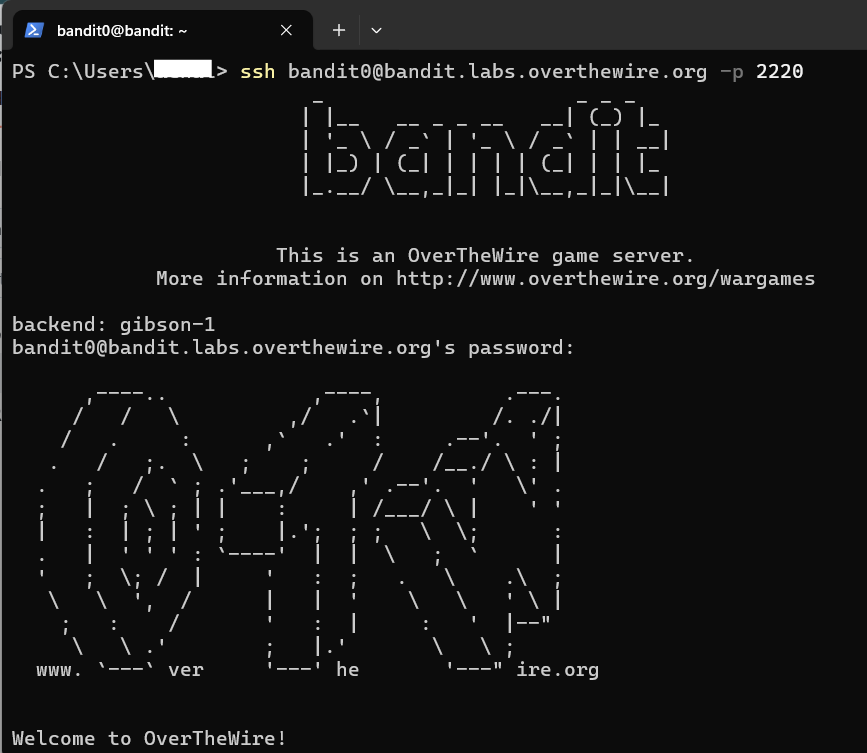
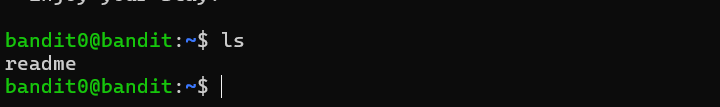
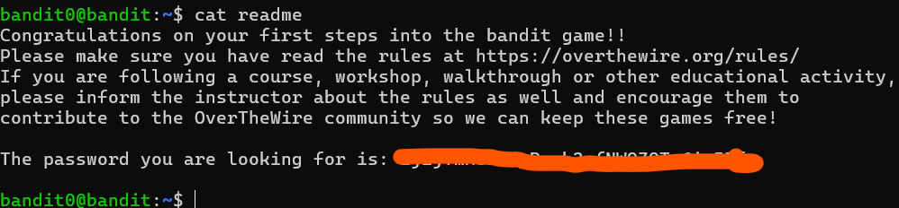
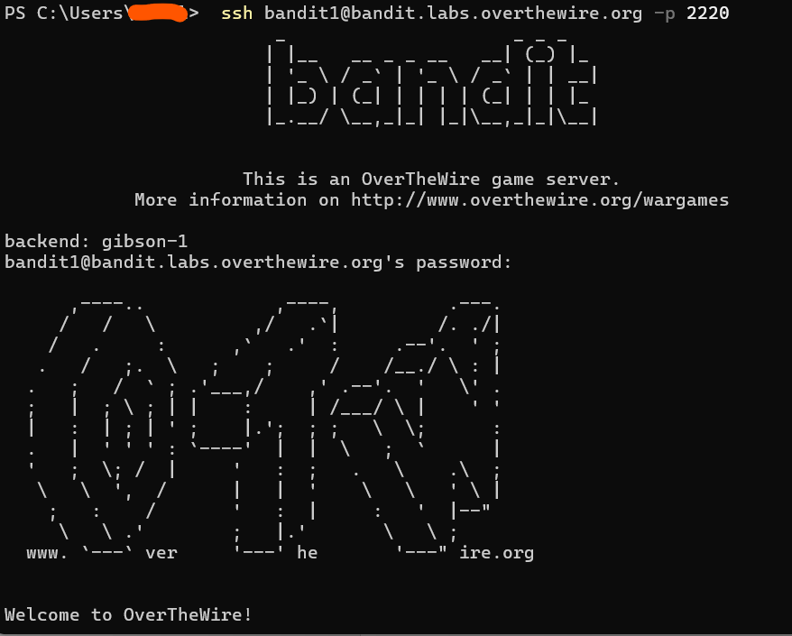

# Bandit Level 0 → Level 1

## Level Goal
The password for the next level is stored in a file called `readme` located in the home directory.

Use this password to log into `bandit1` using SSH on port `2220`.

---

# Concepts Learned

In this level, I learned:
- How to list files using `ls`
- How to read file contents using `cat`
- How to use SSH for remote login
- Importance of saving notes and passwords
- Basic Linux terminal navigation

---

# Commands Used

```bash
ls
cat readme
ssh bandit1@bandit.labs.overthewire.org -p 2220
```

---

# Step-by-Step Solution

## Step 1 — Login to Bandit Level 0

I first connected to the Bandit server using SSH:

```bash
ssh bandit0@bandit.labs.overthewire.org -p 2220
```

When prompted, I entered the password:

```text
bandit0
```



> **Note:** Passwords are invisible while typing in Linux terminals. This is normal behavior for security reasons.

---

## Step 2 — List Files in the Home Directory

After logging in, I checked the files available in the current directory using:

```bash
ls
```



Output:

```text
readme
```

This showed that a file named `readme` exists in the home directory.

---

## Step 3 — Read the File Content

To view the contents of the file, I used:

```bash
cat readme
```



The output displayed the password for **Bandit Level 1**.

---

## Step 4 — Login to Bandit Level 1

Using the password obtained from the `readme` file, I logged into the next level:

```bash
ssh bandit1@bandit.labs.overthewire.org -p 2220
```



I entered the password from the previous step when prompted.

---

# Important Notes

## Save Your Passwords
Passwords are **not saved automatically**.

If passwords are lost, you may need to restart from Level 0.

Passwords obtained during the OverTheWire Bandit challenges are intentionally not included in this repository.

I store challenge passwords locally on my personal system for learning continuity and progress tracking only.

---

# Key Takeaways

- Learned how to list files using `ls`
- Learned how to read files using `cat`
- Practiced SSH login workflow
- Understood importance of note-taking and documentation
- Improved Linux terminal familiarity

---

# Skills Practiced

- Linux Commands
- SSH
- File Enumeration
- File Reading
- Terminal Navigation
- Cybersecurity Fundamentals

---

# Helpful Resources

- [OverTheWire Official Website](https://overthewire.org/wargames/)
- [Linux ls Command Guide](https://linuxize.com/post/how-to-list-files-in-linux-using-the-ls-command/)
- [Linux cat Command Guide](https://www.geeksforgeeks.org/cat-command-in-linux-with-examples/)
- [SSH Wikipedia](https://en.wikipedia.org/wiki/Secure_Shell)
