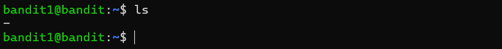

# Bandit Level 1 → Level 2

## Level Goal
The password for the next level is stored in a file called `-` located in the home directory.

---

# Concepts Learned

In this level, I learned:
- How Linux handles special characters in filenames
- Why `-` can cause command confusion
- How to read files with unusual names
- Using relative paths in Linux

---

# Commands Used

```bash
ls
cat ./-
ssh bandit2@bandit.labs.overthewire.org -p 2220
```

---

# Step-by-Step Solution

## Step 1 — Login to Bandit Level 1

I connected to the Bandit Level 1 server using SSH:

```bash
ssh bandit1@bandit.labs.overthewire.org -p 2220
```

I entered the password obtained from the previous level.


---

## Step 2 — List Files

After logging in, I listed the files in the home directory:

```bash
ls
```



Output:

```text
-
```

I noticed that the file name was just a single dash (`-`).

---

## Step 3 — Problem with Dashed Filename

Normally, the `cat` command is used like this:

```bash
cat filename
```

But using:

```bash
cat -
```

does not work correctly because Linux interprets `-` as standard input instead of a normal filename.

---

## Step 4 — Read the File Correctly

To tell Linux that `-` is a file in the current directory, I used:

```bash
cat ./-
```

### Explanation

| Part | Meaning |
|---|---|
| `.` | Current directory |
| `/` | Path separator |
| `-` | Actual filename |

The `./` helps Linux understand that `-` is a file and not a command option.

---


---

## Step 5 — Get the Password

The command displayed the password for **Bandit Level 2**.

---

## Step 6 — Login to Bandit Level 2

Using the discovered password, I connected to the next level:

```bash
ssh bandit2@bandit.labs.overthewire.org -p 2220
```

I entered the password when prompted.


---

# Key Takeaways

- Learned how Linux handles special filenames
- Understood why `-` can create command issues
- Practiced using relative file paths
- Improved Linux terminal problem-solving skills

---

# Skills Practiced

- Linux Commands
- File Handling
- Relative Paths
- SSH
- Terminal Navigation
- Cybersecurity Fundamentals

---

# Helpful Resources

- [OverTheWire Official Website](https://overthewire.org/wargames/)
- [Advanced Bash Scripting Guide](https://tldp.org/LDP/abs/html/)
- [Linux cat Command Guide](https://www.geeksforgeeks.org/cat-command-in-linux-with-examples/)
