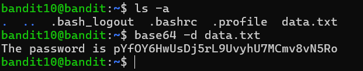

# Bandit Level 10 → Level 11

## 🎯 Level Goal

The password for the next level is stored in the file **`data.txt`**, which contains **Base64 encoded data**.

---

## 📚 Commands Used

- `ls -a`
- `base64`

---

## 📝 Solution

### Step 1: Display all files

```bash
ls -a
```

**Output**

```text
.
..
.bash_logout
.bashrc
.profile
data.txt
```

The current directory contains the file `data.txt`.

---

### Step 2: Decode the Base64 data

Use the `base64` command with the `-d` (decode) option.

```bash
base64 -d data.txt
```

### Explanation

- `base64` → Utility used to encode or decode Base64 data.
- `-d` → Decodes the encoded content.
- `data.txt` → The file containing the Base64-encoded password.

**Output**

```text
The password is pYXf0Rh6uS… (decoded password)
```

In this level, the complete decoded password is:

```text
pYXf0Rh6uSMDj5rL9UvyUHoMcmv8vN5Ro
```

This is the password for **Bandit Level 11**.

---

## 💡 Understanding the `base64` Command

```bash
base64 -d data.txt
```

| Command | Description |
|----------|-------------|
| `base64` | Encodes or decodes Base64 data. |
| `-d` | Decodes Base64-encoded input. |
| `data.txt` | Input file containing the encoded password. |

### What is Base64?

Base64 is an encoding scheme that converts binary data into printable ASCII characters. It is commonly used for transmitting data through text-based protocols such as email, HTTP, and APIs.

---

## 📸 Screenshot



---

## 🔑 Password

```text
pYXf0Rh6uSDj5rL9UvyUHoMcmv8vN5Ro
```

---

## ✅ What I Learned

- Understanding what Base64 encoding is.
- Decoding Base64 data using the `base64` command.
- Using the `-d` option to decode encoded files.
- Recognizing Base64 as a common encoding format used in networking and web applications.
