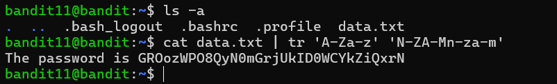

# Bandit Level 11 → Level 12

## 🎯 Level Goal

The password for the next level is stored in the file **`data.txt`**, where all lowercase (`a-z`) and uppercase (`A-Z`) letters have been **rotated by 13 positions (ROT13)**.

---

## 📚 Commands Used

- `ls -a`
- `cat`
- `tr`

---

## 📝 Solution

### Step 1: Display all files

```bash
ls -a
```

**Output**

```text
.
..
.bash_logout
.bashrc
.profile
data.txt
```

The current directory contains the file `data.txt`.

---

### Step 2: Decode the ROT13 text

Use the `tr` command to translate each letter using the ROT13 cipher.

```bash
cat data.txt | tr 'A-Za-z' 'N-ZA-Mn-za-m'
```

### Explanation

- `cat data.txt` → Displays the contents of `data.txt`.
- `|` → Pipes the output of one command to another.
- `tr` → Translates characters from one set to another.
- `'A-Za-z'` → Specifies all uppercase and lowercase English letters.
- `'N-ZA-Mn-za-m'` → Applies the ROT13 transformation.

**Output**

```text
The password is G7w8LIi6J3kTb8A7j9LgrywtEUlyyp6s
```

This is the password for **Bandit Level 12**.

---

## 💡 Understanding the `tr` Command

```bash
cat data.txt | tr 'A-Za-z' 'N-ZA-Mn-za-m'
```

| Command | Description |
|----------|-------------|
| `cat data.txt` | Displays the contents of the file. |
| `tr` | Translates or replaces characters. |
| `A-Za-z` | All uppercase and lowercase letters. |
| `N-ZA-Mn-za-m` | ROT13 mapping used to decode the text. |

### What is ROT13?

ROT13 (Rotate by 13) is a simple substitution cipher that replaces each letter with the letter 13 positions ahead in the alphabet.

Example:

```text
A → N
B → O
C → P
...
N → A
O → B
P → C
```

Applying ROT13 twice returns the original text, making it a reversible cipher.

---

## 📸 Screenshot



---

## 🔑 Password

```text
GRo0zwQPOqyN0mGrjUkID0WCYkZiqxrn
```

---

## ✅ What I Learned

- Understanding the ROT13 substitution cipher.
- Using the `tr` command to translate characters.
- Combining commands using pipes (`|`).
- Performing simple text transformations in Linux.
- Recognizing ROT13 as a common encoding technique in security and CTF challenges.
