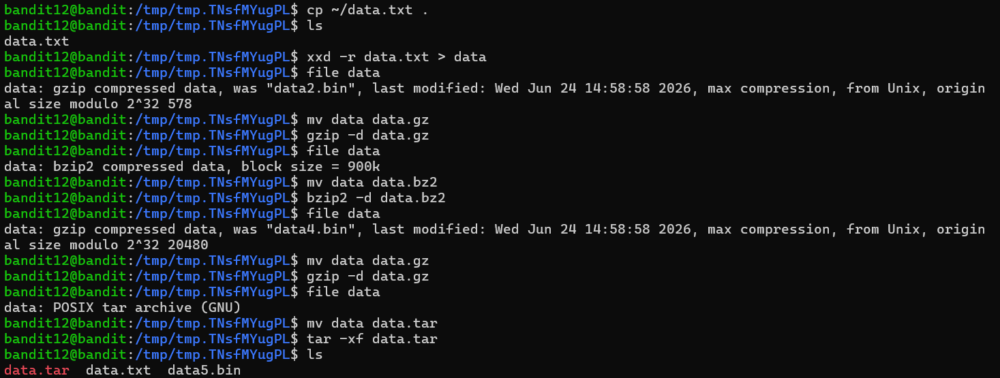
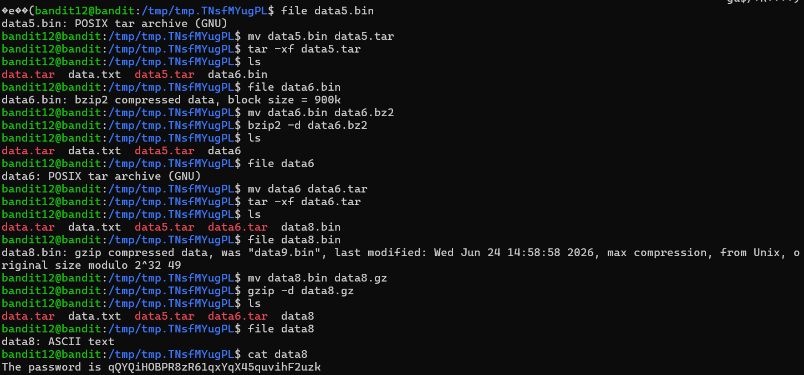

# Bandit Level 12 → Level 13

## 🎯 Level Goal

The password for the next level is stored in the file **`data.txt`**, which is a **hex dump** of a file that has been **repeatedly compressed**.

For this level, it is recommended to create a temporary working directory under `/tmp`, convert the hexadecimal dump back into binary, identify each file type, and repeatedly extract or decompress the file until the final password is revealed.

---

## 📚 Commands Used

- `mktemp`
- `cd`
- `cp`
- `ls`
- `xxd`
- `file`
- `mv`
- `gzip`
- `bzip2`
- `tar`
- `cat`

---

# 📝 Solution

## Step 1: Create a temporary directory

Create a unique temporary directory to safely work with the files.

```bash
mktemp -d
```

**Output**

```text
/tmp/tmp.TNsfMYugPL
```

Move into the directory.

```bash
cd /tmp/tmp.TNsfMYugPL
```

---

## Step 2: Copy the data file

Copy the challenge file into the temporary directory.

```bash
cp ~/data.txt .
```

Verify that the file was copied.

```bash
ls
```

**Output**

```text
data.txt
```

---

## Step 3: Convert the hexadecimal dump back into binary

```bash
xxd -r data.txt > data
```

The `-r` option reverses the hexadecimal dump back into its original binary format.

---

## Step 4: Identify the file type

```bash
file data
```

**Output**

```text
data: gzip compressed data
```

Rename the file with the correct extension and decompress it.

```bash
mv data data.gz
gzip -d data.gz
```

---

## Step 5: Continue identifying and extracting

Check the file type after every extraction.

### 1️⃣ Bzip2

```bash
file data
```

**Output**

```text
data: bzip2 compressed data
```

```bash
mv data data.bz2
bzip2 -d data.bz2
```

---

### 2️⃣ Gzip

```bash
file data
```

**Output**

```text
data: gzip compressed data
```

```bash
mv data data.gz
gzip -d data.gz
```

---

### 3️⃣ Tar Archive

```bash
file data
```

**Output**

```text
data: POSIX tar archive (GNU)
```

```bash
mv data data.tar
tar -xf data.tar
```

List the extracted files.

```bash
ls
```

**Output**

```text
data5.bin
```

---

### 4️⃣ Second Tar Archive

Check the extracted file.

```bash
file data5.bin
```

**Output**

```text
data5.bin: POSIX tar archive (GNU)
```

Extract it.

```bash
mv data5.bin data5.tar
tar -xf data5.tar
```

List the files.

```bash
ls
```

**Output**

```text
data6.bin
```

---

### 5️⃣ Bzip2 Archive

```bash
file data6.bin
```

**Output**

```text
data6.bin: bzip2 compressed data
```

```bash
mv data6.bin data6.bz2
bzip2 -d data6.bz2
```

---

### 6️⃣ Third Tar Archive

```bash
file data6
```

**Output**

```text
data6: POSIX tar archive (GNU)
```

```bash
mv data6 data6.tar
tar -xf data6.tar
```

List the extracted files.

```bash
ls
```

**Output**

```text
data8.bin
```

---

### 7️⃣ Final Gzip Archive

```bash
file data8.bin
```

**Output**

```text
data8.bin: gzip compressed data
```

```bash
mv data8.bin data8.gz
gzip -d data8.gz
```

Check the extracted file.

```bash
file data8
```

**Output**

```text
data8: ASCII text
```

---

## Step 6: Display the password

```bash
cat data8
```

**Output**

```text
The password is qYQRYI0BPBR8zR61qXqQ45quvihF2uzk
```

This is the password for **Bandit Level 13**.

---

## 💡 Understanding the Commands

| Command | Description |
|----------|-------------|
| `mktemp -d` | Creates a unique temporary directory. |
| `cp` | Copies files. |
| `xxd -r` | Reverses a hexadecimal dump into binary. |
| `file` | Detects the type of a file. |
| `mv` | Renames files. |
| `gzip -d` | Decompresses gzip files. |
| `bzip2 -d` | Decompresses bzip2 files. |
| `tar -xf` | Extracts files from a tar archive. |
| `cat` | Displays the contents of a text file. |

---

## 🔄 Extraction Workflow

```text
data.txt
    │
    ▼
Hex Dump
    │
    ▼
xxd -r
    │
    ▼
gzip
    │
    ▼
bzip2
    │
    ▼
gzip
    │
    ▼
tar
    │
    ▼
tar
    │
    ▼
bzip2
    │
    ▼
tar
    │
    ▼
gzip
    │
    ▼
ASCII Text
    │
    ▼
Password
```

---

## 📸 Screenshots

### Create Temporary Directory


### Decompression Process



### Final Password



---

## 🔑 Password

```text
qYQRYI0BPBR8zR61qXqQ45quvihF2uzk
```

---

## ✅ What I Learned

- Creating secure temporary working directories using `mktemp`.
- Reversing hexadecimal dumps with `xxd -r`.
- Identifying unknown file formats using the `file` command.
- Working with multiple compression formats (`gzip`, `bzip2`, and `tar`).
- Renaming files with appropriate extensions before decompression.
- Systematically analyzing and extracting nested compressed files.
- Applying Linux command-line tools to solve real-world file forensics and Capture The Flag (CTF) challenges.
