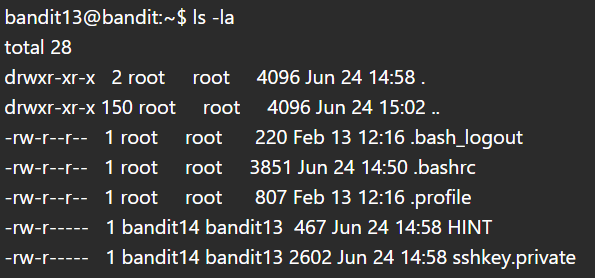
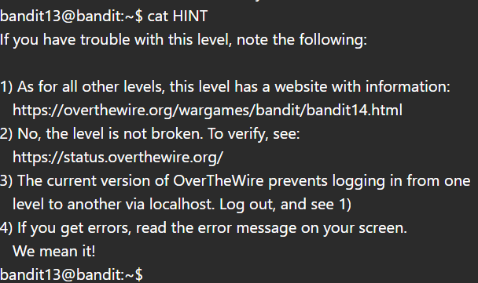
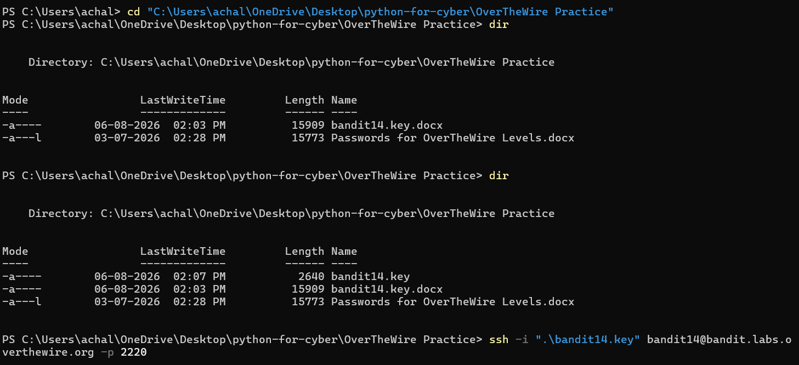
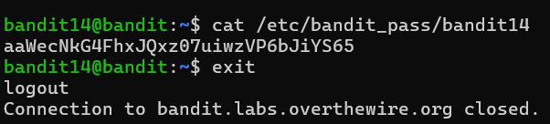

# Bandit Level 13 → Level 14

## Objective

Retrieve the password for **bandit14** by authenticating with the provided SSH private key instead of a password. The password is stored in `/etc/bandit_pass/bandit14` and can only be accessed after successfully logging in as the `bandit14` user.

---

## Commands Used

```bash
ls -la
cat HINT
cat sshkey.private
ssh -i bandit14.key bandit14@bandit.labs.overthewire.org -p 2220
cat /etc/bandit_pass/bandit14
```

---

## Solution

1. Listed the files in the home directory.

```bash
ls -la
```

Output showed two important files:

* `HINT`
* `sshkey.private`

2. Read the hint file.

```bash
cat HINT
```

The hint explains that connecting from `localhost` is no longer supported. Instead, the provided private key must be copied to the local machine and used to authenticate directly with the Bandit server.

3. Displayed the contents of the private key.

```bash
cat sshkey.private
```

Copied the complete OpenSSH private key and saved it locally as:

```text
bandit14.key
```

4. Connected to the Bandit server using the private key.

```bash
ssh -i bandit14.key bandit14@bandit.labs.overthewire.org -p 2220
```

5. After successful authentication, retrieved the password for the next level.

```bash
cat /etc/bandit_pass/bandit14
```

---

## Explanation

This level introduces **SSH key-based authentication**, which is widely used in Linux servers, cloud environments, and enterprise infrastructure.

Unlike previous levels that relied on passwords, this challenge requires authentication using a private SSH key. The private key is supplied to the SSH client with the `-i` option. Once authenticated as `bandit14`, the protected password file becomes accessible.

---

## Security Concept

### SSH Key Authentication

SSH uses asymmetric cryptography for secure authentication.

* **Private Key**: Kept secret by the user and never shared.
* **Public Key**: Stored on the server and used to verify the client.

Compared to password-based authentication, SSH keys provide stronger security and reduce the risk of brute-force attacks.

---

## Key Learning

* Identified and used an OpenSSH private key.
* Understood modern SSH key-based authentication.
* Connected to a remote system using the `ssh -i` option.
* Retrieved a protected file after successful authentication.
* Learned that newer Bandit versions require connecting from the local machine instead of using `localhost`.

---

## Commands Summary

| Command                                                            | Purpose                                |
| ------------------------------------------------------------------ | -------------------------------------- |
| `ls -la`                                                           | List all files, including hidden files |
| `cat HINT`                                                         | Read the challenge hint                |
| `cat sshkey.private`                                               | Display the private SSH key            |
| `ssh -i bandit14.key bandit14@bandit.labs.overthewire.org -p 2220` | Authenticate using the private key     |
| `cat /etc/bandit_pass/bandit14`                                    | Retrieve the next level password       |

---

## Screenshots

Include the following screenshots (with the password redacted):

1. Listing the home directory (`ls -la`)
   
   
3. Viewing the `HINT` file
   
   
5. Successful SSH login using the private key
   
   
7. Retrieving the password from `/etc/bandit_pass/bandit14`
   

---

## Notes

* Never upload private SSH keys or Bandit passwords to a public repository.
* Redact sensitive information in screenshots before committing them.
* Use plain text editors (such as VS Code or Notepad) to save SSH private keys. Do not save them as `.docx` or other formatted document types.
