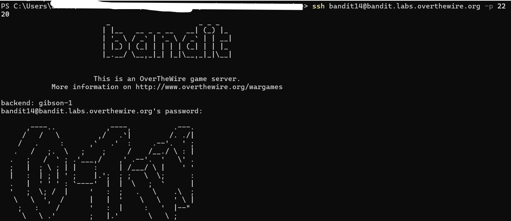
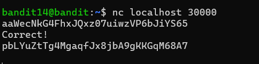

# Bandit Level 14 → Level 15

## Objective

Retrieve the password for **bandit15** by submitting the current level's password to a service listening on **TCP port 30000** on `localhost`.

---

## Commands Used

```bash
ssh bandit14@bandit.labs.overthewire.org -p 2220
nc localhost 30000
```

Alternative one-line solution:

```bash
echo "<bandit14_password>" | nc localhost 30000
```

---

## Solution

1. Logged in to the `bandit14` account using the password obtained from the previous level.

```bash
ssh bandit14@bandit.labs.overthewire.org -p 2220
```

2. Connected to the service running on **localhost** at **TCP port 30000**.

```bash
nc localhost 30000
```

3. Submitted the current level's password.

4. The service validated the password and returned the password for **bandit15**.

---

## Explanation

Unlike previous levels, the password is **not stored in a file**. Instead, it must be sent to a network service running locally on the Bandit server.

The `nc` (Netcat) utility establishes a TCP connection to the specified host and port. After the current level's password is submitted, the service verifies the input and responds with the password for the next level.

This level introduces basic client-server communication and demonstrates how applications exchange data over TCP.

---

## Security Concept

### TCP Client-Server Communication

TCP (Transmission Control Protocol) provides reliable communication between a client and a server.

In this challenge:

* **Client:** `nc` (Netcat)
* **Server:** Service listening on `localhost:30000`
* **Protocol:** TCP

The client sends the current password, and the server returns the next password after successful verification.

---

### Netcat (`nc`)

Netcat is a lightweight networking utility commonly used by system administrators and penetration testers to:

* Connect to TCP/UDP services
* Test open ports
* Debug network applications
* Send and receive data
* Verify network connectivity
* Perform basic service enumeration

Because of its flexibility, Netcat is often referred to as the **"Swiss Army Knife of Networking."**

---

## Key Learning

* Connected to a TCP service using Netcat.
* Understood the concept of client-server communication.
* Learned how applications exchange data over network ports.
* Used Netcat to interact with a running service and retrieve sensitive information after successful authentication.

---

## Commands Summary

| Command                                            | Purpose                                   |
| -------------------------------------------------- | ----------------------------------------- |
| `ssh bandit14@bandit.labs.overthewire.org -p 2220` | Log in to the Bandit server               |
| `nc localhost 30000`                               | Connect to the TCP service on port 30000  |
| `echo "<password>" \| nc localhost 30000`          | Send the password directly to the service |

---

## Screenshots

Include the following screenshots (with the password redacted):

1. Successful login to `bandit14`
   
   
3. Executing `nc localhost 30000`
5. Submitting the password to the service
6. Receiving the success message and next-level password
   

---

## Real-World Relevance

Understanding TCP communication and tools like Netcat is essential in cybersecurity. During penetration testing and security assessments, Netcat is frequently used to:

* Verify whether services are reachable
* Interact with custom network services
* Troubleshoot client-server communication
* Validate exposed ports during reconnaissance
* Test application responses over TCP connections

---

## Notes

* Do **not** upload Bandit passwords or private credentials to public repositories.
* Redact passwords from screenshots before publishing.
* This level demonstrates how network services can authenticate clients and return responses using a simple TCP connection.
