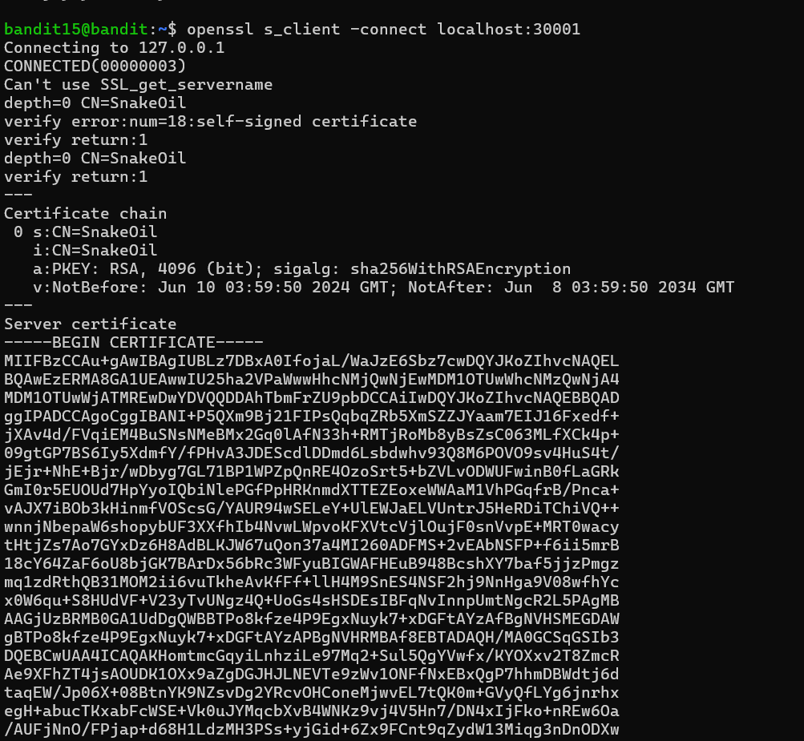
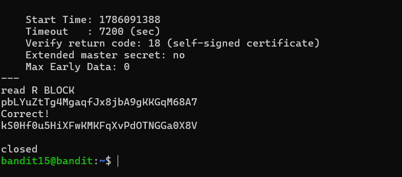

# Bandit Level 15 → Level 16

## Objective

Retrieve the password for **bandit16** by submitting the current level's password to a service listening on **localhost port 30001** using **SSL/TLS encryption**.

---

## Commands Used

```bash
ssh bandit15@bandit.labs.overthewire.org -p 2220
openssl s_client -connect localhost:30001
```

Alternative one-line solution:

```bash
echo "<bandit15_password>" | openssl s_client -connect localhost:30001 -quiet
```

---

## Solution

1. Logged in to the `bandit15` account using the password obtained from the previous level.

```bash
ssh bandit15@bandit.labs.overthewire.org -p 2220
```

2. Connected to the SSL/TLS-enabled service running on **localhost:30001**.

```bash
openssl s_client -connect localhost:30001
```

3. After the TLS handshake completed, submitted the current level's password.

4. The server verified the password and returned the password for **bandit16**.

---

## Explanation

Unlike the previous level, which used an unencrypted TCP connection with Netcat, this level requires communication over an encrypted **SSL/TLS** channel.

The `openssl s_client` command establishes a secure connection with the server, performs the TLS handshake, and allows interactive communication. Once the correct password is submitted through the encrypted channel, the server responds with the password for the next level.

---

## Security Concept

### SSL/TLS Encryption

**SSL (Secure Sockets Layer)** and **TLS (Transport Layer Security)** provide encrypted communication between a client and a server.

During the connection:

1. The client initiates a TLS handshake.
2. The server presents its digital certificate.
3. Encryption parameters are negotiated.
4. A secure communication channel is established.
5. Sensitive information, such as passwords, is transmitted securely.

This prevents attackers from reading or modifying data in transit.

---

### OpenSSL s_client

`openssl s_client` is a diagnostic tool used to communicate with SSL/TLS-enabled services.

Common uses include:

* Testing HTTPS and TLS services
* Viewing server certificates
* Debugging SSL/TLS handshakes
* Verifying encrypted connections
* Troubleshooting certificate-related issues

---

## Key Learning

* Established a secure SSL/TLS connection using OpenSSL.
* Understood the difference between encrypted and unencrypted network communication.
* Learned how TLS protects sensitive information during transmission.
* Used `openssl s_client` to interact with a secure network service.

---

## Commands Summary

| Command                                                                 | Purpose                                           |
| ----------------------------------------------------------------------- | ------------------------------------------------- |
| `ssh bandit15@bandit.labs.overthewire.org -p 2220`                      | Log in to the Bandit server                       |
| `openssl s_client -connect localhost:30001`                             | Connect to the TLS-enabled service                |
| `echo "<password>" \| openssl s_client -connect localhost:30001 -quiet` | Send the password through an encrypted connection |

---

## Screenshots

Include the following screenshots (with the password redacted):

1. Successful login to `bandit15` and executing `openssl s_client -connect localhost:30001`


  
2. Submitting the password and Receiving the success message and next-level password



---

## Real-World Relevance

SSL/TLS is the foundation of secure communication on modern networks. Security professionals use tools like `openssl s_client` to:

* Validate encrypted services
* Inspect digital certificates
* Test secure application endpoints
* Diagnose TLS configuration issues
* Verify secure communication during penetration testing and security assessments

---

## Notes

* Do **not** upload Bandit passwords or private credentials to public repositories.
* Redact sensitive information from screenshots before publishing.
* This level demonstrates how secure communication differs from plain TCP by introducing SSL/TLS encryption.
