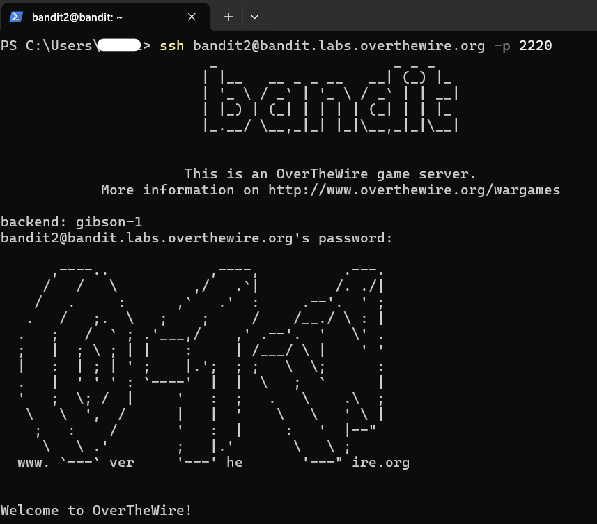
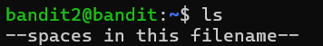
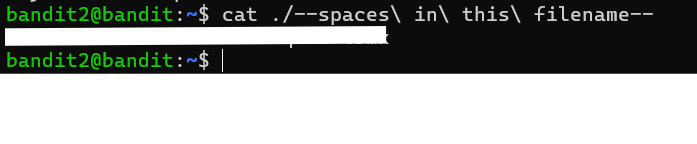

# Bandit Level 2 → Level 3

## Level Goal

The password for the next level is stored in a file called:

```text
--spaces in this filename--
```

located in the home directory.

---

# Concepts Learned

In this level, I learned:
- How Linux handles filenames with spaces
- Escaping special characters using `\`
- Using relative file paths with `./`
- Reading files with unusual names

---

# Commands Used

```bash
ls
cat
```

---

# Step 1 — Login to the Server

I connected to the Bandit server using SSH:

```bash
ssh bandit2@bandit.labs.overthewire.org -p 2220
```

After entering the password for `bandit2`, I successfully logged in.



---

# Step 2 — List Files

I listed the files in the home directory:



```bash
ls
```

Output:

```text
--spaces in this filename--
```

---

# Problem Faced

The filename contains:
- Spaces
- Special characters (`--`)

Linux treats spaces as separators between arguments, so using:

```bash
cat --spaces in this filename--
```

would not work correctly.

---

# Step 3 — Escape Spaces Properly

To read the file correctly, I escaped each space using `\` and used `./` before the filename:

```bash
cat ./--spaces\ in\ this\ filename--
```

---

# Password Retrieved



The command displayed the password for the next level successfully.

> Note: Password intentionally hidden for security and learning purposes.

---

# Explanation

## Why Use `\` ?

The backslash (`\`) tells Linux:

```text
Treat the next space as part of the filename
```

instead of separating commands.

---

# Why Use `./` ?

The filename starts with:

```text
--
```

Linux may interpret this as a command option.

Using:

```bash
./filename
```

tells Linux:
```text
This is a file in the current directory
```

---

# Alternative Solution

Using quotes also works:

```bash
cat "./--spaces in this filename--"
```

---

# Key Takeaways

- Spaces in filenames must be escaped or quoted
- `./` helps avoid command-option confusion
- Linux filenames can contain special characters
- Understanding shell parsing is important in cybersecurity and Linux

---

# Skills Practiced

- Linux File Handling
- Escaping Characters
- SSH Access
- Linux Terminal Navigation
- Reading Files with Special Names

