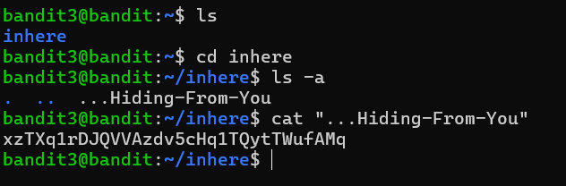

# Bandit Level 3 → Level 4

## 🎯 Level Goal

The password for the next level is stored in a hidden file inside the `inhere` directory.

---

## 🧠 Concept

In Linux, files and directories whose names begin with a dot (`.`) are considered **hidden files**. These files are not displayed with the normal `ls` command. To view them, use the `-a` option.

---

## 🛠️ Commands Used

```bash
ls
cd inhere
ls -a
cat "...Hiding-From-You"
```

---

## 💻 Step-by-Step Solution

### Step 1: List the files

```bash
bandit3@bandit:~$ ls
```

**Output**

```text
inhere
```

---

### Step 2: Enter the directory

```bash
bandit3@bandit:~$ cd inhere
```

---

### Step 3: Display hidden files

```bash
bandit3@bandit:~/inhere$ ls -a
```

**Output**

```text
.
..
...Hiding-From-You
```

The file `...Hiding-From-You` is the hidden file containing the password.

---

### Step 4: Read the hidden file

```bash
bandit3@bandit:~/inhere$ cat "...Hiding-From-You"
```

**Output**

```text
<password>
```

Use this password to log in to **Bandit Level 4**.

---

## 📸 Screenshot



---

## 📖 Commands Explained

| Command | Description |
|----------|-------------|
| `ls` | Lists files and directories |
| `cd` | Changes the current directory |
| `ls -a` | Displays all files, including hidden files |
| `cat` | Displays the contents of a file |

---

## 🔑 Key Takeaways

- Hidden files in Linux begin with a `.` (dot).
- Use `ls -a` to display hidden files.
- Use `cat` to read the contents of a file.
- Quoting filenames is helpful when they contain special characters.

---

> **Note:** For public GitHub repositories, avoid publishing the actual Bandit passwords. Replace them with `<password>` or `<redacted>` so others can complete the challenge themselves.
