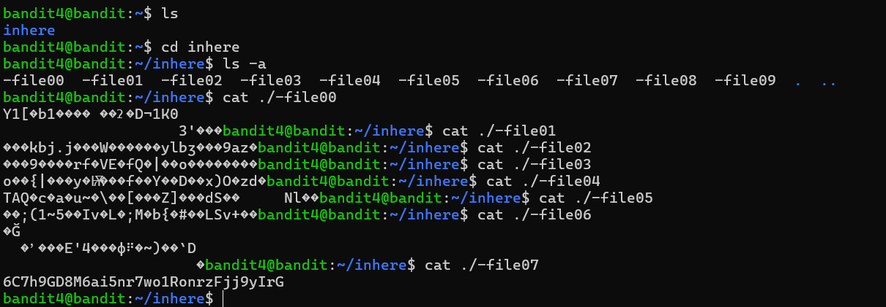

# Bandit Level 4 → Level 5

## 🎯 Level Goal

The password for the next level is stored in the **only human-readable file** in the `inhere` directory.

---

## 📚 Commands Used

- `ls`
- `cd`
- `ls -a`
- `cat`
- `file`

---

## 📝 Solution

### Step 1: List the current directory

```bash
ls
```

**Output**

```text
inhere
```

Move into the directory.

```bash
cd inhere
```

---

### Step 2: Display all files

```bash
ls -a
```

**Output**

```text
-file00
-file01
-file02
-file03
-file04
-file05
-file06
-file07
-file08
-file09
```

All files begin with `-`, so prefix the filename with `./` when using commands.

---

### Step 3: Identify the human-readable file

Since the password is stored in the **only human-readable file**, check each file using the `file` command.

```bash
file ./-file00
file ./-file01
file ./-file02
file ./-file03
file ./-file04
file ./-file05
file ./-file06
file ./-file07
file ./-file08
file ./-file09
```

**Output (important part)**

```text
./-file07: ASCII text
```

Only `-file07` is human-readable.

---

### Step 4: Read the password

```bash
cat ./-file07
```

**Output**

```text
6C7h9GD8M6ai5nr7wolRnrzFj9jYlrG
```

This is the password for **Bandit Level 5**.

---

## 💡 Why `./` is Required?

The filenames start with a hyphen (`-`).

Without `./`, commands treat the filename as an option.

❌ Incorrect

```bash
cat -file07
```

✅ Correct

```bash
cat ./-file07
```

Using `./` tells Linux that it is a file in the current directory, not a command-line option.

---

## 📸 Screenshot



---

## 🔑 Password

```text
6C7h9GD8M6ai5nr7wolRnrzFj9jYlrG
```

---

## ✅ What I Learned

- Using `ls -a` to list all files.
- Handling filenames that begin with `-`.
- Using the `file` command to determine file types.
- Identifying human-readable files.
- Reading file contents with `cat`.

---

**Next Level:** Bandit Level 5 → Level 6
