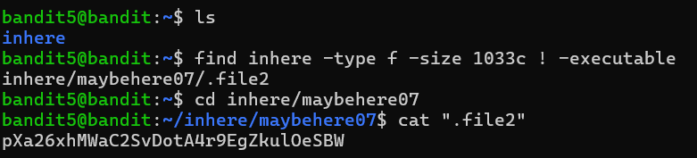

# Bandit Level 5 → Level 6

## 🎯 Level Goal

The password for the next level is stored in a file somewhere under the `inhere` directory and has all of the following properties:

- Human-readable
- Exactly **1033 bytes** in size
- Not executable

---

## 📚 Commands Used

- `ls`
- `find`
- `cd`
- `cat`

---

## 📝 Solution

### Step 1: List the current directory

```bash
ls
```

**Output**

```text
inhere
```

---

### Step 2: Search for the required file

The `find` command can search based on file type, size, and permissions.

```bash
find inhere -type f -size 1033c ! -executable
```

### Explanation

- `inhere` → Search inside the `inhere` directory.
- `-type f` → Search only regular files.
- `-size 1033c` → File size must be exactly **1033 bytes** (`c` = bytes).
- `! -executable` → File must **not** have executable permission.

**Output**

```text
inhere/maybehere07/.file2
```

---

### Step 3: Navigate to the directory

```bash
cd inhere/maybehere07
```

---

### Step 4: Read the file

```bash
cat .file2
```

**Output**

```text
pXa26xHMhWaC2SvDoDAL3P9gzkUoeSBW
```

This is the password for **Bandit Level 6**.

---

## 💡 Understanding the `find` Command

```bash
find inhere -type f -size 1033c ! -executable
```

| Option | Description |
|---------|-------------|
| `find` | Searches for files and directories. |
| `inhere` | Starting directory for the search. |
| `-type f` | Search only regular files. |
| `-size 1033c` | Match files that are exactly **1033 bytes**. |
| `! -executable` | Exclude executable files. |

Using these filters together quickly narrows the search to the correct file.

---

## 📸 Screenshot



---

## 🔑 Password

```text
pXa26xHMhWaC2SvDoDAL3P9gzkUoeSBW
```

---

## ✅ What I Learned

- Using the `find` command with multiple search conditions.
- Searching files by exact size.
- Filtering regular files using `-type f`.
- Excluding executable files with `! -executable`.
- Reading hidden files using `cat`.
- Combining search filters to efficiently locate specific files.
