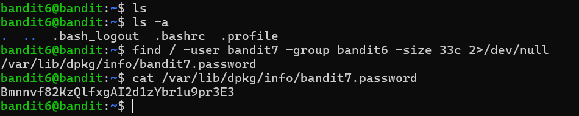

# Bandit Level 6 → Level 7

## 🎯 Level Goal

The password for the next level is stored **somewhere on the server** and has all of the following properties:

- Owned by user **bandit7**
- Owned by group **bandit6**
- Exactly **33 bytes** in size

---

## 📚 Commands Used

- `ls`
- `ls -a`
- `find`
- `cat`

---

## 📝 Solution

### Step 1: Check the current directory

```bash
ls
```

No useful files are present.

Display hidden files as well.

```bash
ls -a
```

**Output**

```text
.
..
.bash_logout
.bashrc
.profile
```

Since the password is stored **somewhere on the server**, searching only the current directory is not enough.

---

### Step 2: Search the entire filesystem

Use the `find` command with the required conditions.

```bash
find / -user bandit7 -group bandit6 -size 33c 2>/dev/null
```

### Explanation

- `/` → Start searching from the root directory.
- `-user bandit7` → File must be owned by user **bandit7**.
- `-group bandit6` → File must belong to group **bandit6**.
- `-size 33c` → File size must be exactly **33 bytes**.
- `2>/dev/null` → Hide permission denied and other error messages.

**Output**

```text
/var/lib/dpkg/info/bandit7.password
```

---

### Step 3: Read the password

```bash
cat /var/lib/dpkg/info/bandit7.password
```

**Output**

```text
BmrmnvbfqR2k0lIfQ8A42z75eCZ5M5R3
```

This is the password for **Bandit Level 7**.

---

## 💡 Understanding the `find` Command

```bash
find / -user bandit7 -group bandit6 -size 33c 2>/dev/null
```

| Option | Description |
|---------|-------------|
| `find /` | Search the entire filesystem starting from the root directory. |
| `-user bandit7` | Match files owned by the user **bandit7**. |
| `-group bandit6` | Match files belonging to the group **bandit6**. |
| `-size 33c` | Match files that are exactly **33 bytes** in size. |
| `2>/dev/null` | Suppress permission denied and other error messages by redirecting standard error to `/dev/null`. |

---

## 📸 Screenshot



---

## 🔑 Password

```text
BmrmnvbfqR2k0lIfQ8A42z75eCZ5M5R3
```

---

## ✅ What I Learned

- Searching the entire Linux filesystem using `find`.
- Finding files based on **owner**, **group**, and **size**.
- Using multiple search filters together.
- Redirecting error messages using `2>/dev/null`.
- Reading files using the `cat` command.
- Understanding why searching from the root directory (`/`) is useful when the file location is unknown.
