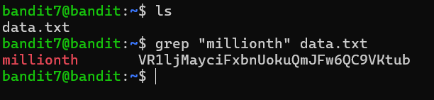

# Bandit Level 7 → Level 8

## 🎯 Level Goal

The password for the next level is stored in the file **`data.txt`** next to the word **`millionth`**.

---

## 📚 Commands Used

- `ls`
- `grep`

---

## 📝 Solution

### Step 1: List the files

```bash
ls
```

**Output**

```text
data.txt
```

The current directory contains a single file named `data.txt`.

---

### Step 2: Search for the required word

Use the `grep` command to search for the line containing the word **`millionth`**.

```bash
grep "millionth" data.txt
```

**Output**

```text
millionth    vrTJJaYq6FbnpNokuQmJW6oQC9Vktub
```

The second field on the line is the password for the next level.

---

## 💡 Understanding the `grep` Command

```bash
grep "millionth" data.txt
```

| Option | Description |
|---------|-------------|
| `grep` | Searches for lines containing a specified pattern. |
| `"millionth"` | The keyword to search for. |
| `data.txt` | The file in which the search is performed. |

`grep` prints the entire line that matches the search pattern, making it easy to locate the required password.

---

## 📸 Screenshot



---

## 🔑 Password

```text
vrTJJaYq6FbnpNokuQmJW6oQC9Vktub
```

---

## ✅ What I Learned

- Using `grep` to search for specific text within a file.
- Finding information based on a keyword.
- Reading command output to extract the required value.
- Understanding that `grep` returns the complete matching line.
