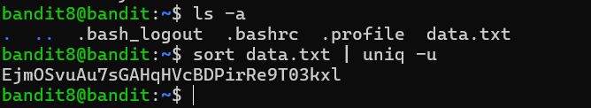

# Bandit Level 8 → Level 9

## 🎯 Level Goal

The password for the next level is stored in the file **`data.txt`** and is the **only line of text that occurs exactly once**.

---

## 📚 Commands Used

- `ls -a`
- `sort`
- `uniq`

---

## 📝 Solution

### Step 1: Display all files

```bash
ls -a
```

**Output**

```text
.
..
.bash_logout
.bashrc
.profile
data.txt
```

The current directory contains the file `data.txt`.

---

### Step 2: Find the unique line

Since `uniq` only detects adjacent duplicate lines, first sort the file and then use `uniq -u` to display only the unique line.

```bash
sort data.txt | uniq -u
```

### Explanation

- `sort data.txt` → Sorts all lines alphabetically so duplicate lines are placed together.
- `|` → Sends the output of `sort` as input to the next command.
- `uniq -u` → Prints only the lines that appear exactly once.

**Output**

```text
Ejn0SuaU7fSGWHqVVDBDpirRe9T03kXL
```

This is the password for **Bandit Level 9**.

---

## 💡 Understanding the Commands

### `sort`

```bash
sort data.txt
```

Sorts all lines in alphabetical order. This is necessary because `uniq` only works correctly on consecutive duplicate lines.

### `uniq -u`

```bash
uniq -u
```

| Option | Description |
|---------|-------------|
| `uniq` | Filters repeated adjacent lines. |
| `-u` | Displays only lines that occur exactly once. |

Using both commands together efficiently finds the unique line in the file.

---

## 📸 Screenshot



---

## 🔑 Password

```text
Ejn0SuaU7fSGWHqVVDBDpirRe9T03kXL
```

---

## ✅ What I Learned

- Using `sort` to arrange file contents alphabetically.
- Understanding why `uniq` requires sorted input.
- Using pipes (`|`) to combine Linux commands.
- Finding unique lines in a text file with `uniq -u`.
- Building efficient command pipelines for text processing.
