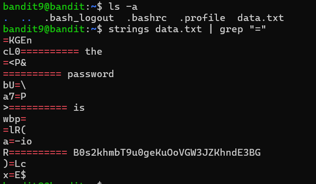

# Bandit Level 9 → Level 10

## 🎯 Level Goal

The password for the next level is stored in the file **`data.txt`** in one of the few **human-readable strings**, preceded by several **`=`** characters.

---

## 📚 Commands Used

- `ls -a`
- `strings`
- `grep`

---

## 📝 Solution

### Step 1: Display all files

```bash
ls -a
```

**Output**

```text
.
..
.bash_logout
.bashrc
.profile
data.txt
```

The current directory contains the file `data.txt`.

---

### Step 2: Extract human-readable strings

Since `data.txt` is a binary file, use the `strings` command to extract all printable text and filter the output using `grep`.

```bash
strings data.txt | grep "="
```

### Explanation

- `strings data.txt` → Extracts printable (human-readable) strings from the binary file.
- `|` → Sends the output of `strings` to the next command.
- `grep "="` → Displays only the lines containing the `=` character.

**Output**

```text
========== BfMYroe26WYalil77FoDi9qh59eK5xNr
```

The password is the text that appears after the `==========` characters.

---

## 💡 Understanding the Commands

### `strings`

```bash
strings data.txt
```

Extracts readable ASCII strings from a binary file.

### `grep`

```bash
grep "="
```

| Command | Description |
|----------|-------------|
| `grep "="` | Searches for every line containing the `=` character. |

> **Tip:** You can make the search more precise by using:

```bash
strings data.txt | grep "^==="
```

This searches only for lines that begin with multiple `=` characters.

---

## 📸 Screenshot



---

## 🔑 Password

```text
BfMYroe26WYalil77FoDi9qh59eK5xNr
```

---

## ✅ What I Learned

- Using `strings` to extract readable text from binary files.
- Filtering command output with `grep`.
- Combining commands using pipes (`|`).
- Understanding how binary files can contain hidden readable information.
- Using pattern matching to locate specific data efficiently.
